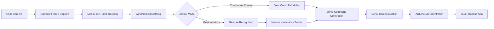

# Gesture-Based Robot Control Honours Project


A computer-vision-based human–robot interaction prototype that uses real-time hand tracking and gesture recognition to control a 3D-printed 3DoF robotic arm.

This repository contains the software, control modules, Arduino communication layer, and 3D-printing files for an undergraduate honours project in **BSc Robotics and Artificial Intelligence** at the **University of Hull**.

---

## Project Overview

The aim of this project is to evaluate whether gesture-based control can provide an intuitive, accessible, and usable alternative to conventional robotic control interfaces. Instead of focusing only on recognition accuracy, the project evaluates the complete interaction pipeline: camera input, hand landmark tracking, gesture interpretation, control mapping, serial communication, and physical actuation.

The system uses a standard RGB camera to track hand landmarks in real time. Detected gestures and hand movements are translated into robotic commands, which are sent to an Arduino microcontroller to actuate a 3D-printed robotic arm.

The project is designed as a **usability-focused prototype**, not an industrial-ready robotic system.

---

## Key Features

- Real-time hand tracking using **MediaPipe Hands**
- Live video processing using **OpenCV**
- Continuous gesture-based joint control
- Discrete gesture mode for predefined robot actions
- Separate left-hand and right-hand control mappings
- PID-based proportional control for smoother joint response
- One Euro Filter smoothing to reduce landmark jitter
- Inverse kinematics support for target-based arm positioning
- Custom serial communication protocol between Python and Arduino
- Servo ID, pulse-width, and checksum validation for safer communication
- 3D-printable robotic arm components included as STL files

---

## System Architecture

The project follows a perception-control-actuation architecture:



The computer handles the computationally heavier vision, tracking, gesture recognition, and control logic. The Arduino receives validated serial packets and produces PWM servo signals for the physical robot.

---

## Repository Structure

```text
Gesture-Based-Robot-Control-Honours-Project/
│
├── 3D STL Files/
│   └── 3D-printable robotic arm components
│
├── GestureRecognition/
│   ├── gestureRecognition.py      # Rule-based gesture recognition
│   ├── tracking.py                # MediaPipe hand tracking and landmark handling
│   └── vidCapture.py              # OpenCV video capture wrapper
│
├── RobotControl/
│   ├── ArduinoControl/
│   │   └── ArduinoControl.ino     # Arduino servo control firmware
│   ├── BaseControl.py             # Base rotation control
│   ├── ElbowControl.py            # Elbow joint control
│   ├── GripperControl.py          # Gripper control from finger distance
│   ├── PID.py                     # PID controller implementation
│   ├── WristControl.py            # Shoulder/wrist control logic
│   ├── kinematicsSolver.py        # Inverse kinematics solver
│   └── utils.py                   # Servo angle / PWM utility functions
│
├── Comms.py                       # Python-to-Arduino serial communication
├── main.py                        # Main hand-tracking controller loop
├── requirements.txt               # Python dependencies
└── README.md
```

---

## Hardware

The physical system consists of a low-cost 3D-printed robotic arm and an Arduino-based actuation layer.

| Component | Quantity | Purpose |
|---|---:|---|
| MG996R servo | 3 | Base, shoulder, and elbow actuation |
| SG90 servo | 1 | Gripper actuation |
| Arduino UNO R3 | 1 | Servo control and serial command execution |
| RGB camera / webcam | 1 | Real-time hand tracking input |
| PLA 3D-printed parts | Multiple | Robotic arm body, links, base, and gripper |
| USB cable | 1 | Serial communication between Python and Arduino |

The robotic arm contains a rotating base, shoulder joint, elbow joint, and servo-driven gripper. The arm was designed for affordability, manufacturability, and ease of prototyping rather than industrial precision.

---

## Software Stack

| Layer | Technology |
|---|---|
| Programming language | Python |
| Computer vision | OpenCV |
| Hand tracking | MediaPipe Hands |
| Landmark smoothing | One Euro Filter |
| Control | PID control, distance mapping, inverse kinematics |
| Communication | PySerial |
| Embedded control | Arduino / C++ |
| Actuation | PWM servo control |

---

## Control Modes

The application supports three operating modes:

| Key | Mode | Description |
|---|---|---|
| `1` | View | Displays hand tracking without sending active control commands |
| `2` | Control | Enables continuous hand-based control of the robotic arm |
| `3` | Gesture | Enables symbolic gesture recognition and predefined robotic actions |
| `q` | Quit | Exits the program |

---

## Gesture and Joint Mapping

### Continuous Control Mode

| Hand | Input Feature | Controlled Joint |
|---|---|---|
| Left hand | Thumb-index finger distance | Gripper open / close |
| Left hand | Horizontal wrist position | Base rotation |
| Right hand | Thumb-index finger distance | Elbow movement |
| Right hand | Horizontal wrist position | Shoulder / wrist movement |

This mapping separates control responsibilities between hands to reduce ambiguity and improve learnability.

### Gesture Mode

Gesture mode recognises predefined symbolic gestures and maps them to robot actions. For example, a recognised **thumbs-up** gesture triggers a predefined target pose through the inverse kinematics solver.

---

## Installation

### 1. Clone the Repository

```bash
git clone https://github.com/AlexandrosBrew/Gesture-Based-Robot-Control-Honours-Project.git
cd Gesture-Based-Robot-Control-Honours-Project
```

### 2. Create a Virtual Environment

```bash
python -m venv .venv
```

Activate it:

```bash
# macOS / Linux
source .venv/bin/activate

# Windows
.venv\Scripts\activate
```

### 3. Install Python Dependencies

```bash
pip install -r requirements.txt
```

---

## Arduino Setup

1. Open `RobotControl/ArduinoControl/ArduinoControl.ino` in the Arduino IDE.
2. Connect the Arduino UNO to the computer.
3. Select the correct board and serial port.
4. Upload the sketch.
5. Connect the servos to the expected control pins.

Default servo mapping in the Arduino firmware:

| Servo ID | Joint | Arduino Pin |
|---:|---|---:|
| 0 | Gripper | 5 |
| 1 | Shoulder / wrist | 3 |
| 2 | Elbow | 2 |
| 3 | Base | 6 |

The Arduino firmware expects binary serial packets with a header byte, servo ID, position bytes, and checksum.

---

## Serial Port Configuration

The current Python communication module uses a hard-coded serial port. Before running the system, check the port in `Comms.py`:

```python
port='/dev/cu.usbmodem1101'
```

Change this to match your device:

```python
# macOS example
port='/dev/cu.usbmodemXXXX'

# Linux example
port='/dev/ttyACM0'

# Windows example
port='COM3'
```

The default baud rate is:

```python
baudrate=115200
```

---

## Running the System

After installing dependencies and uploading the Arduino firmware:

```bash
python main.py
```

A camera window should open. Use the keyboard controls to switch between view, continuous control, and gesture mode.

---

## Testing Summary

The project was evaluated using unit testing, integration testing, and technical performance testing.

| Metric | Result |
|---|---:|
| Unit tests | Passed |
| Integration tests | 6 / 7 passed |
| Gesture recognition accuracy | 90% |
| Multi-hand detection accuracy | 95% |
| Average frame rate | 24.6 FPS |
| Average latency | 0.13 s |

The system successfully demonstrated real-time gesture-based control under controlled indoor conditions.

---

## Limitations

This project is a prototype and has several important limitations:

- Performance is dependent on lighting, camera placement, and background conditions.
- Gesture recognition accuracy reduces at larger distances from the camera.
- The system was tested under controlled conditions rather than broad real-world environments.
- The robotic arm uses low-cost hobby servos rather than closed-loop industrial actuators.
- The system does not include formal multi-user testing.
- The 3D-printed PLA structure is suitable for prototyping but not long-term heavy-duty use.
- Gesture mode can create sudden movements if predefined target transitions are not smoothed.

---

## Future Work

Potential improvements include:

- Adding formal user testing and System Usability Scale evaluation
- Improving transition smoothing for gesture-triggered inverse kinematics movements
- Expanding the gesture vocabulary
- Adding calibration tools for different users and camera setups
- Implementing closed-loop servo or encoder feedback
- Improving robustness under varied lighting and background conditions
- Supporting multi-user detection and user-specific gesture tracking
- Adding a graphical user interface for mode selection, calibration, and diagnostics

---

## Academic Context

This repository was developed as part of an undergraduate honours project:

**Project:** Gesture-Based Robotic Control  
**Course:** BSc Robotics and Artificial Intelligence  
**Institution:** University of Hull  
**Author:** Alexandros Brew  

The project investigates gesture-based human–robot interaction using accessible hardware, open-source computer vision tools, and a low-cost robotic arm prototype.

---

## Disclaimer

This project is intended for academic demonstration and educational research. It is not safety-certified and should not be used in industrial, medical, or high-risk environments without substantial redesign, validation, and safety engineering.

---

## Author

**Alexandros Brew**  
BSc Robotics and Artificial Intelligence  
University of Hull

---
